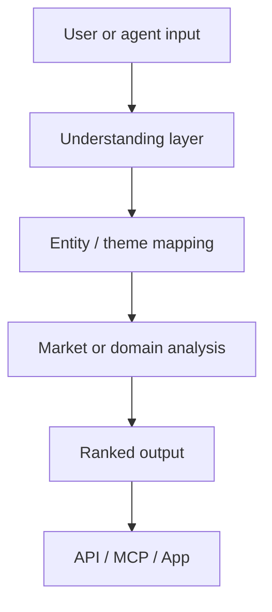

# Andy Swan

**Founder / AI Product Builder**

I build consumer-intelligence products and the interfaces that put them in front of humans and agents.

Founder of [LikeFolio](https://likefolio.com) with Landon Swan. Shipping [Scenario Navigator](https://scenarionavigator.io) and public MCP tools.

[andyswan.com](https://andyswan.com) · [LikeFolio](https://likefolio.com) · [LikeFolio.ai](https://likefolio.ai) · [Scenario Navigator](https://scenarionavigator.io) · [𝕏 @andyswan](https://x.com/andyswan)

---

## Building

| Product | What it is | Status |
| --- | --- | --- |
| [LikeFolio](https://likefolio.com) | Consumer demand signals for investors — Main Street behavior before Wall Street consensus | Production |
| [LikeFolio MCP](https://likefolio.ai/mcp) | Same demand data as native MCP tools for Claude, Cursor, and other agents | Production |
| [Scenario Navigator](https://scenarionavigator.io) | News scenario in → ranked public-company impact out (API + Python SDK + MCP) | Production / Beta |
| [InspectFlow](https://cosmoswan.github.io/InspectFlow/) | Speak a property walkthrough → structured inspection report | Prototype |

---

## What I work on

- **Financial AI** — demand scores, scenario impact, research automation
- **Alternative data** — consumer behavior mapped to public companies
- **APIs & MCP** — machine-readable products agents can call directly
- **Vertical AI apps** — focused tools built fast
- **Agent tooling** — MCP servers, SDKs, and thin clients around live data products

---

## Selected projects

### LikeFolio MCP
Consumer-demand alt-data for agents. Main Street vs Wall Street scores on 500+ US stocks, divergences, history, and related research tools — with as-of dates and citation URLs.

Repo: [likefolio-mcp](https://github.com/CosmoSwan/likefolio-mcp) · Docs: [likefolio.ai/mcp](https://likefolio.ai/mcp)

### Scenario Navigator
Turn a plain-language news scenario into a ranked list of potentially affected public companies. Python SDK on PyPI (`scenario-navigator`) plus MCP tools for agents.

Site: [scenarionavigator.io](https://scenarionavigator.io) · Showcase: [scenario-navigator-showcase](https://github.com/CosmoSwan/scenario-navigator-showcase)

### InspectFlow
Mobile-friendly prototype: record or upload a site walk, get a system-by-system report with ratings, safety flags, and PDF export.

Live demo: [cosmoswan.github.io/InspectFlow](https://cosmoswan.github.io/InspectFlow/) · Repo: [InspectFlow](https://github.com/CosmoSwan/InspectFlow)

---

## How systems tend to look

High-level only. Implementation details stay private.

---

## Elsewhere

- Personal site: [andyswan.com](https://andyswan.com)
- LikeFolio: [likefolio.com](https://likefolio.com) · [likefolio.ai](https://likefolio.ai)
- Scenario Navigator: [scenarionavigator.io](https://scenarionavigator.io)
- X: [@andyswan](https://x.com/andyswan)
